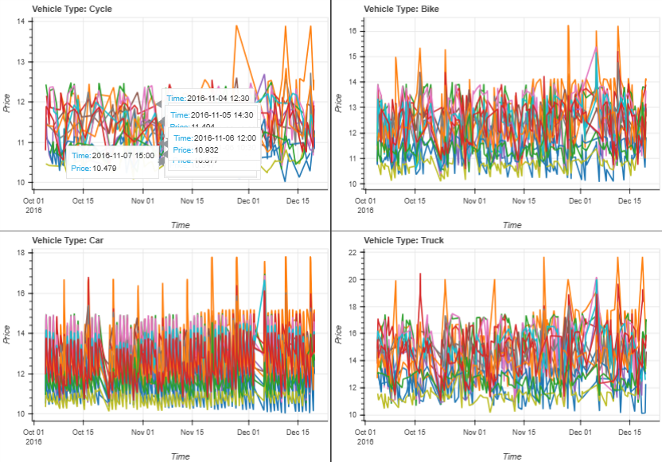
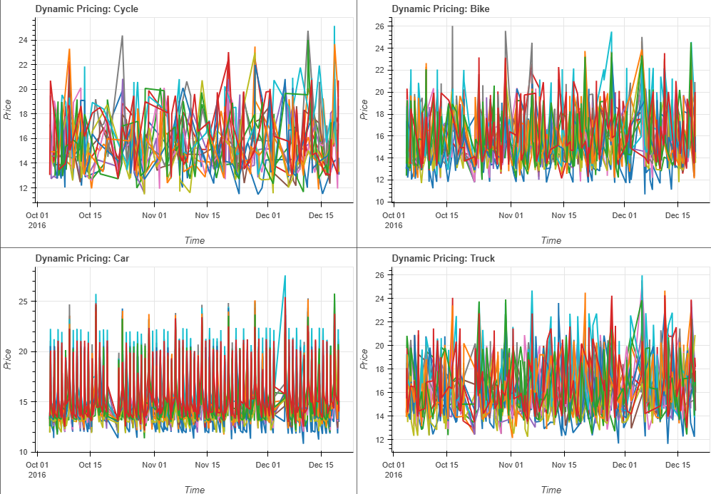

# Capstone Project (Dynamic Pricing Model For Parking)

## Overview

This project is a **real-time dynamic pricing system** for urban parking lots, where the parking fee is adjusted based on key demand factors like occupancy, traffic, queue length, special day status, and vehicle type. The solution uses **Pathway** for streaming data processing and **Bokeh + Panel** for live visualization. The pricing model ensures fair and optimized fee adjustment to balance demand and availability, enhancing smart city infrastructure.

---

## Tech Stack

- **Python 3**
- **Pathway** – Real-time dataflow and streaming analytics
- **Pandas** – Preprocessing and CSV operations
- **Bokeh** – Visualization
- **Panel** – Interactive UI with Bokeh support
- **Google Colab** – Notebook interface (testing and demonstration)

---

## Architecture Diagram
---


---

## Architecture & Workflow

### 1. **Data Preparation**

- Raw parking data is read from a CSV (`dataset.csv`) containing columns like `Timestamp`, `SystemCodeNumber`, `VehicleType`, `Occupancy`, `QueueLength`, `TrafficConditionNearby`, etc.
- `VehicleType` is mapped to a numerical weight (car: 1.0, bike: 0.8, etc.).
- `TrafficConditionNearby` is normalized into numeric values (low: 0.0, average: 0.5, high: 1.0).
- Processed data is saved into `parking_stream.csv`.

### 2. **Real-Time Stream Processing**

- `Pathway` reads the processed data using `pw.demo.replay_csv()` to simulate real-time input.
- Data is windowed using **30-minute tumbling intervals** grouped by `SystemCodeNumber`.

---

## Pricing Models

### Model 1: Simple Multiplicative Model

```python
Price = 10 + alpha * (Occupancy / Capacity) * VehicleWeight * (1 + beta * IsSpecialDay)
```
pros:
-  Fast, low-latency pricing

cons:
-  Less context-aware (ignores traffic, queue)

**Real-Time Price Plot (Model 1)**:&#x20;


**Static Multi-line Plot (Model 1)**:&#x20;



---

### Model 2: Advanced Demand-Based Model

```python
Demand = ALPHA * (Occupancy / Capacity)
       + BETA * QueueLength
       - GAMMA * Traffic
       + DELTA * IsSpecialDay
       + EPSILON * VehicleWeight

Price = BASE_PRICE * (1 + LAMBDA * Demand)
```
pros:
-  Richer contextual signals
-  Controlled price range (\$10 to \$25)
  
cons:
-  Slightly more compute-heavy

**Real-Time Price Plot (Model 2)**:&#x20;


**Static Multi-line Plot (Model 2)**:&#x20;



---

## Project Structure

```bash
.
├── dataset.csv                      # Original input data
├── parking_stream.csv              # Preprocessed stream file
├── half_hourly_price_output.csv    # Exported price table from Pathway
├── pricing_engine.py               # Pathway streaming + pricing logic
├── dashboard.py                    # Bokeh + Panel visualization code
├── README.md                       # This documentation
└── (Optional) report.pdf           # Add if project report is available
```

---

## Notes

- The system is modular and can be extended to include:
  - **Real-time map visualization**
  - **API integration with parking sensors**
  - **Advanced ML-based demand prediction**
- Pricing logic is rule-based but can be hybridized with historical demand models.

---


